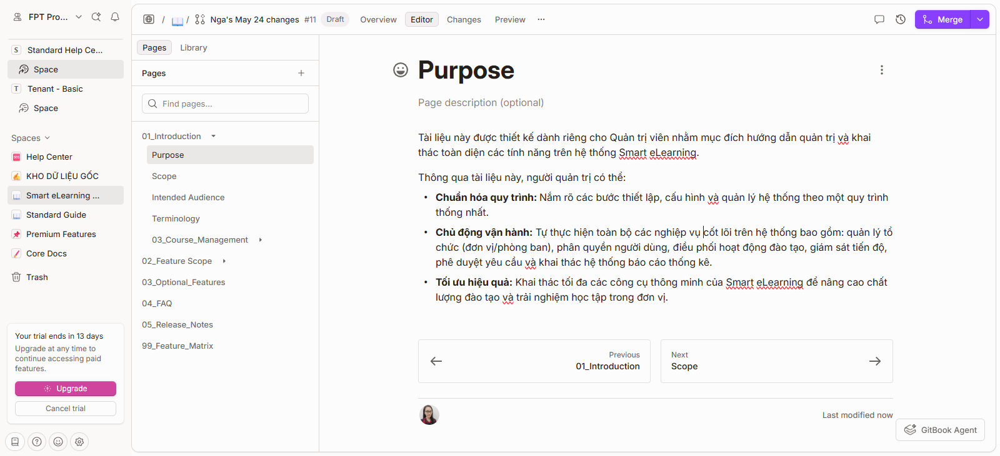

# 01\_Create\_Course

## Overview

Chức năng Create Course hỗ trợ Tenant Admin tạo khóa học mới trên hệ thống phục vụ hoạt động đào tạo.

## Role & Permission

| Role         | Text               |
| ------------ | ------------------ |
| Tenant Admin | Create/Edit Course |
| Course Admin | Create/Edit Course |

## Prerequisite

* Đã đăng nhập
* Có quyền quản lý khóa học

## Navigation

Course Management\
→ Create Course

## Steps

1. Chọn Create Course

<figure><figcaption></figcaption></figure>

1. Nhập thông tin khóa học
2. Cấu hình thời gian học
3. Nhấn Save

## Expected Result

Khóa học được tạo thành công và ở trạng thái Draft.

## Business Rules

* Course code là duy nhất
* Course chưa publish không hiển thị cho learner
* Quyền thao tác phụ thuộc role

## Related Pages

* Course Content [02\_course\_content.md](02_course_content.md "mention")
* Enrollment [03\_enrollment.md](03_enrollment.md "mention")
* Publish Course [04\_publish\_course.md](04_publish_course.md "mention")
